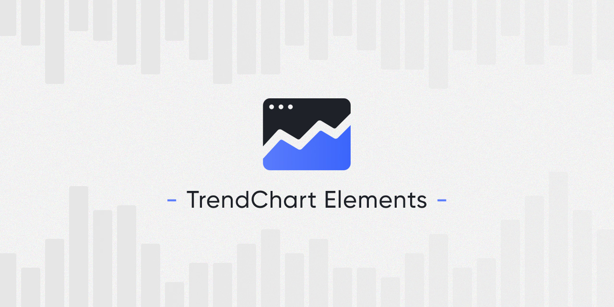
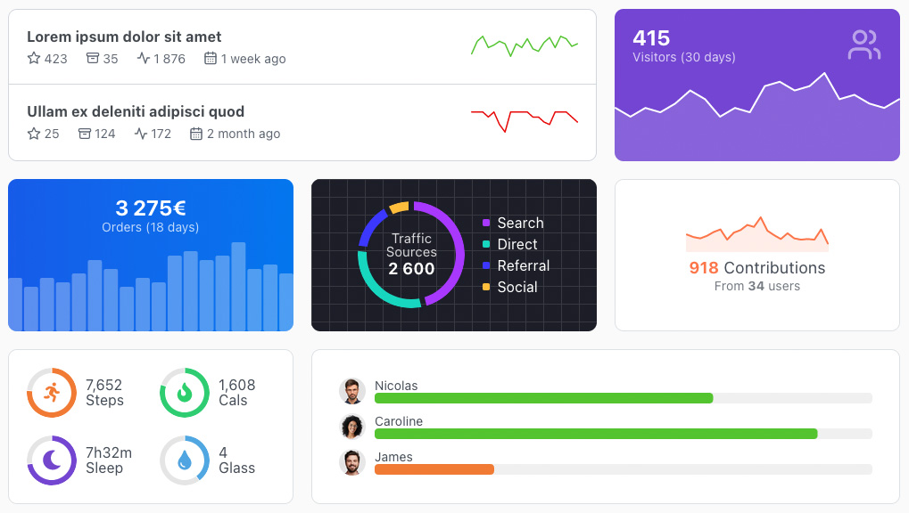

# TrendChart Elements

Web components to generate simple, light and responsive charts representing trends.

<p align="center">
    
</p>

It is often useful to display some simple charts to represent a data visualization trend without the need of a big chart library, TrendChart Elements is made for that. The aim was to be as plug-and-play as possible, like native HTML tags, so all the configuration is made with CSS variables and HTML attributes. It's fully responsive with built-in basic tooltip.

Tested on modern browsers : `Chrome >= 73`, `Firefox >= 63`, `Edge >= 79`, `Safari >= 12`


## Installation

Install the package with NPM :

```
npm install @weblogin/trendchart-elements
```

Import into your project code :

```javascript
// All the charts
import '@weblogin/trendchart-elements';
// Only some charts
import { TcLine } from "@weblogin/trendchart-elements";
```


## Usage

<p align="center">
    
</p>

**Check out the [demo page](https://weblogin.github.io/trendchart-elements/demo/)** for various charts, stylings and use cases.

```html
<tc-line values="[12,10,12,11,7,6,8,10,12]"></tc-line>
<tc-column values="[11,7,6,8,10,12,8,10,12]"></tc-column>
<tc-bar values="[11,7,6,8,10,12,8,10,12]"></tc-bar>
<tc-pie values="[35,68,22,16]"></tc-pie>
```

Charts configuration is made with CSS variables and HTML attributes.

Use CSS to change the `width` and `height` of the chart, because they are responsive you can use percentages. In some cases you'll need to have a radius around the chart if its container has one, for that just add a `border-radius` CSS rule to the chart.

#### HTML attributes

- Common
	- `values` - Required array of numbers for the values. Example `values="[12,10,11]"` - Default `[]`
	- `labels` - Optional array of strings for the labels corresponding to the values, it needs to be the same length as `values` array. Only usefull with tooltips not disabled. Example `labels='["Foo","Bar","Baz"]'` - Default `[]`
	- `min` - Optional number or null for the minimum `Y axis` value, in most cases you'll need to add it to `0`. When `null` the chart uses the smallest value - Default `null`
	- `max` - Optional number or null for the maximum `Y axis` value, usefull if you need to have multiple charts with the same scale. When `null` the chart uses the highest value - Default `null`
	- `tooltip-disabled` - Optional attribute to disable the tooltip, it doesn't need a value, just add the attribute
	- `tooltip-text` - Optional string to format the tooltip text. Two placeholders are available, `@V` being the current value and `@L` the current label if present - Default `@L @V`
- Line chart
	- `shape-size` - Optional number for the line size - Default `2`
- Column / Bar chart
	- `shape-radius` - Optional number for the columns / bars radius - Default `1`
	- `shape-gap` - Optional number for the gap between columns / bars - Default `1`
- Pie chart
	- `shape-size` - Optional number or null for the slice size, `null` gives a pie and a `number` create a donut - Default `null`
	- `shape-gap` - Optional number for the gap between slices - Default `1`

#### CSS variables

- Common
	- `--shape-color` - Default `#597BFC`
	- `--shape-opacity` - Default `1`
	- `--area-color` - Default `var(--shape-color)`
	- `--area-opacity` - Default `0`
	- `--tooltip-font-color` - Default `white`
	- `--tooltip-font-size` - Default `0.875em`
	- `--tooltip-font-weight` - Default `bold`
	- `--tooltip-radius` - Default `3px`
	- `--tooltip-padding` - Default `3px 4px`
	- `--tooltip-background` - Default `black`
	- `--tooltip-shadow` - Default `none`
- Line chart
	- `--point-color` - Default `var(--shape-color)`
	- `--point-opacity ` - Default `1`
	- `--point-shadow ` - Default `none `
- Column / Bar chart
	- `--shape-focused-opacity` - Column / Bar opacity on hover - Default `0.5`
- Pie chart
	- `--shape-focused-opacity` - Slice opacity on hover - Default `0.5`


## License

The MIT License (MIT). Please see [License File](LICENSE.md) for more information.
