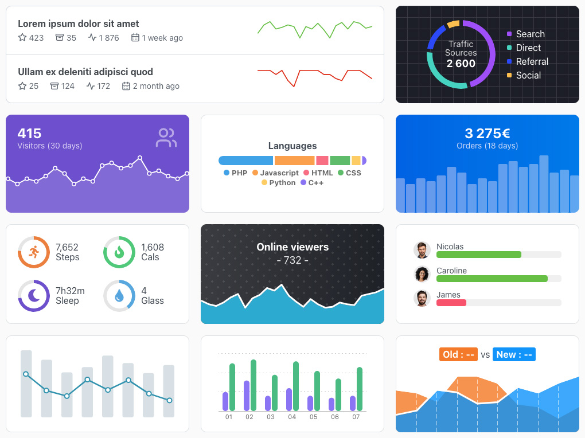

# TrendChart Elements

Web components to generate simple, light and responsive charts representing trends.

<p align="center">
    
</p>

It is often useful to display some simple charts to represent a data visualization trend without the need of a big chart library, TrendChart Elements is made for that. The aim was to be as plug-and-play as possible, like native HTML tags, so all the configuration is made with CSS variables and HTML attributes. It's fully responsive with built-in basic tooltip.

`10.5ko` minified and gzipped, tree-shakeable, written in TypeScript, and no dependency except [Lit](https://github.com/lit/lit/) to create web components (50% of the package size). Tested on modern browsers : `Chrome >= 73`, `Firefox >= 63`, `Edge >= 79`, `Safari >= 12`.


## Installation

Install the package with NPM :

```
npm install @weblogin/trendchart-elements
```

Import into your project code :

```javascript
// All the charts
import '@weblogin/trendchart-elements';
// Only some charts
import { TcLine } from "@weblogin/trendchart-elements";
```


## Update from V1

Some of the markup has changed to make room for new features, have a look at the documentation below to find the new names.


## Usage

<p align="center">
    
    <br>
    <b>Check out <a href="https://weblogin.github.io/trendchart-elements/demo/" target="_blank">the demo page</a> for various charts stylings and use cases.</b>
</p>

```html
<tc-line values="[12,10,12,11,7,6,8,10,12]"></tc-line>
<tc-pie values="[35,68,22,16]"></tc-pie>
<tc-bar values="[11,7,6,8,10,12,8,10,12]"></tc-bar>
<tc-stack values="[24,18,19,7]"></tc-stack>
```

Use CSS to change the `width` and `height` of the chart, because they are responsive you can use percentages.

In some cases you'll need to have a radius around the chart if its container has one, for that just add a `border-radius` CSS rule to the chart.

Charts configuration is made with CSS variables and HTML attributes :
	
### HTML Attributes
 
| Name | Default | Description |
| :--- | :-----: | :---------- |
| ➡️ **All charts** |||
| `values` | - | Required - Array of numbers for the values, at least 2 for line and bar charts. Example : `values="[12,10,11]"` |
| `labels` | `[]` | Optional - Array of strings for the labels corresponding to the values, it needs to be the same length as `values` array. Example : `labels='["A","B","C"]'` |
| `static` | `false` | Optional - Boolean to disable tooltip and hover styling |
| `tooltip-disabled` | `false` | Optional - Boolean to disable tooltip |
| `tooltip-format` | `@L @V` | Optional - String to format the tooltip text. Two placeholders are available, `@V` for the current value and `@L` for the current label if present |
| `max` | `0` | Optional - Number to change the max scale of the chart |
| ➡️ **Line chart** |||
| `min` | `0` | Optional - Number to change the min scale of the chart |
| `weight` | `2` | Optional - Number for the line weight |
| `point` | `undefined` | Optional - Number for the point weight, if not set it will be `weight + 6` |
| `inside` | `false` | Optional - Boolean to draw the points inside the chart. Because the line touch the edges by default, the points have half of their size outside the chart. Usefull if all points are visible |
| ➡️ **Bar chart** |||
| `min` | `0` | Optional - Number to change the min scale of the chart |
| `radius` | `2` | Optional - Number for the radius of the bars |
| `horizontal` | `false` | Optional - Boolean to change the orientation to horizontal |
| `gap` | `2` | Optional - Number for the gap between bars |
| ➡️ **Stack chart** |||
| `radius` | `2` | Optional - Number for the radius of the global bar |
| `horizontal` | `false` | Optional - Boolean to change the orientation to horizontal |
| `gap` | `2` | Optional - Number for the gap between bars |
| ➡️ **Pie chart** |||
| `donut` | `undefined` | Optional - Number to create a donut of the given weight |
| `rotate` | `0` | Optional - Number in degrees to rotate the chart, 0 being the top |
| `gap` | `2` | Optional - Number for the gap between slices |

For boolean ones you just have to set them on the tag, like this :

```html
<tc-bar values="[3,9,10]" static><tc-bar>
```

### CSS Variables
 
| Name | Default | Description |
| :--- | :-----: | :---------- |
| ➡️ **All charts** |||
| `--shape-color` | `#597BFC` | - |
| `--shape-opacity` | `1` | - |
| `--residual-color` | `black` | The residual represent unused space, for example if you set a `max` of 100 but the highest value is lower |
| `--residual-opacity` | `0` | - |
| `--tooltip-font-color` | `white` | - |
| `--tooltip-font-size` | `0.875em` | - |
| `--tooltip-font-weight` | `bold` | - |
| `--tooltip-radius` | `3px` | - |
| `--tooltip-padding` | `3px 4px` | - |
| `--tooltip-background` | `black` | - |
| `--tooltip-shadow` | `none` | - |
| ➡️ **Line chart** |||
| `--area-color` | `--shape-color` | The area represent the space under the line |
| `--area-opacity` | `0` | - |
| `--point-inner-color` | `--shape-color` | - |
| `--point-border-color` | `--shape-color` | - |
| `--point-opacity` | `0` | - |
| `--point-opacity-active` | `1` | - |
| ➡️ **Bar / Stack / Pie chart** |||
| `--shape-color-x` | `--shape-color` | Color of the `x` shape starting at 1 : `--shape-color-1`, `--shape-color-2`, etc |
| `--shape-opacity-active` |`0.5` | Opacity of the current active shape |

### Events

Several custom events are fired so you can react to them. For some events the `detail` property of the event contains associated data. Have a look at the bottom of the [demo page](https://weblogin.github.io/trendchart-elements/demo/#test-events) to see a test for events (in the console).

| Name | Description | Detail |
| ---- | ----------- | :----: |
| `computed` | Fire everytime the chart is computed | `null` |
| `shape-enter` | Fire on mouse enter a value shape | `Object` |
| `shape-leave` | Fire on mouse leave a value shape | `Object` |
| `shape-click` | Fire on mouse click on a value shape | `Object` |

### JS API

Even if TrendChart Elements is supposed to be used as a simple chart system, several properties are exposed so you can interact with the chart programmatically. In addition to the [HTML Attributes](#html-attributes) above, here are some other usefull ones :

| Name | Description |
| ---- | ----------- |
| `valueShapes` | Array of `valueShape` objects. Each represent a value that will be displayed in the chart |
| `valueShapeActive` | Getter for the current active `valueShape` object |
| `active` | Index of the current active `valueShape`, can be used to manually set the active index |

```js
// <tc-line values="[12,10,12,11,7,6,8,10,12]"></tc-line>
const lineChart = document.querySelector('tc-line');
lineChart.active = 3;
```

## License

TrendChart Elements is licensed under the [MIT license](https://opensource.org/licenses/MIT).
